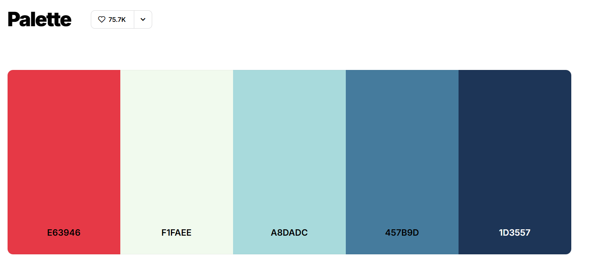
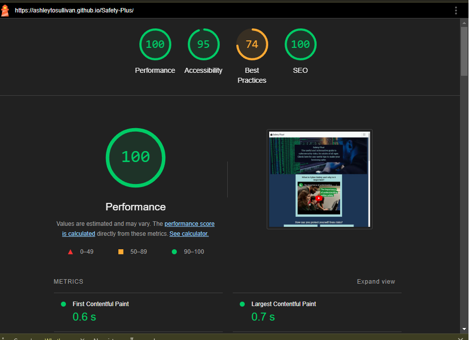

# Safety Plus
Individual Formative Assignment: HTML, CSS, Bootstrap

# Introduction
Safety Plus! is a my first assessed project for the AI Assisted Full Stack Web Developer Bootcamp.
This project will be utilising HTML, CSS, Bootstrap & Microsoft Copilot assisted code to fulfill the brief for this project.
Safety Plus! is a handy cybersecurity guide for adults to safely navigate the tricky worldwide web.

Python bash - python3 -m http.server

## Overview

The live project can be found here: <a href="https://ashleytosullivan.github.io/Safety-Plus/" target="blank"> Live Project</a>

# Introduction

With this project I wanted to create a simple guide for people who may struggle with tech literacy to navigate the treacherous water of the world wide web.
People are taught to troubleshoot and use critical thinking less and less when it comes to technology, so I believe easy guides will be useful to avoid issues.

## User Stories 
* As a user, I want to understand better how to avoid security risks
* As a user I want to be able to find resources to help me understand what cybersecurity is 
* As a user I want to be able to navigate the website easily via a menu
* As a user I want to be able to view this website on a phone, tablet and computer screen
* As a user I want social media pages to follow for more help
* As a user I want easy to udnerstand tips and guidelines

I used Microsoft Copilot to generate user stories for this section, editing them for simplicity and ease of hitting the criteria of this project.
Using these stories, I created a project plan to meet these objectives.

# Initial Design with Wireframes

Wireframes have been created using Balsamiq. The goal was to create an easy to navigate and understand page, as this project is aimed at those who may struggle with tech literacy.

#### Wireframe 1 - PC

#### Wireframe 1 - Mobile

The layout for these changed slightly throughout the coding process. Utilising Bootstrap 5.3, the initial designs were met, however the key difference implemented was a carousel to the testimonials section. This is to make the page less busy and utilise more of the learned material throughout the course so far.

## Fonts

Fonts were a large consideration for this project and were selected and implemented via Google Fonts. The aim was to find one that was easy to read yet not dull. Described in my notes as a "business casual" font. After implementing a number of font styles, eventually I decided to use "Roboto" as the main font.

## Colours
The colour scheme was a large consideration for this project. I elected to use the below palette as they were nicely contrasting colours and when implemented, met the WCAG critera for accessibility.

## Features

### General Features 

To fill the criteria of the project, the page includes numerous features, coded manually, using Microsoft Copilot and the Bootstrap 5.3 framework.

#### Navigation Section
The Navbar was created using the standard Bootstrap Navbar and manually modified to use the relevant navigation links. Adding to it also a Lock Symbol and "burger" dropdown symbol, both from https://fontawesome.com/ 

#### Hero Section

The Hero Section was created using a prompt with Microsoft Copilot. This initially placed the header and paragraph texts below the hero image, requiring manual intervention. Utilising code suggestions from https://www.w3schools.com/ I adjusted the HTML and CSS code to include the text overlay class, adjusting it to how I wished for it to appear. Another issue caused by Copilot was the sizing of the hero image on smaller screens, which required manual targeting and media queries to fix.

#### About Section

This section was created using a simple card with Bootstrap and embedding a youtube video. Manual size adjustment was needed, to ensure the video fit within the container. The main issue this has caused was causing the Lighthouse Best Practices score to drop.

### Cards pass WCAG Guidelines

#### Learn Section

The Learn section remained largely the same as the wireframe design, but implementing a 2x2 card layout to avoid cluttering of the page. The cards were used with Bootstrap 5.3 frameworks. Implementing text from the attributed links in the cards. Using a different colour in the palette to stand out from the rest of the page. Another change implemented was a slight enlargement of the cards when hovered over, to emphasise which section is being looked at.

#### Testimonials Section

The Testimonials changed the most from the initial design. Rather than having numerous floating heads with quotes, after testing I decided to change these to a carousel. This helped keep the page clean on multiple devices, while still being readable. A few issues arose with the bootstrap design;

* image sizing required a targeted change to make them uniform
* The navigation buttons moved around depending on the image, set the viewport height to solve the issue
* The images and text overlayed with each-other when navigating. Wrapping the images and text in seperate divs solved this issue.

#### Footer

The footer section was created manually, however utilising the Bootstrap Framework for the Contact Us button and form. The colour is changed to another from the Coolor palette to make it stand out further. 

## Use of AI

The criteria for use of AI were as follows 

1.  Use AI tools to assist in code creation.
    - Microsoft Copilot was the primary AI code creation source used. It was used mostly for aligning the web page and assisting in targeted CSS. The other main use for it was in creation of the sections, with starter code for each individual section, barring the footer.

2. Use AI tools to assist in debugging code
    - Copilot was used to debug the code, finding very little beyond a couple of unclosed div tags.

3. Use AI tools to optimize code for performance and user experience
    - Asking Copilot to optimise the code resulted in few results as it had been assisting throughout. It removed some redundant css code and helped ensure the CSS and HTML codes were valid

4. Reflect on AI’s role in the development process and its impact on workflow
    - AI has proven to be an exceptionally useful tool in regards to code creation and streamlining the purpose. It has made a few mistakes and oftentimes not completely done what was requested. It is not a suitable replacement for human work, but a powerful tool when utilised correctly. Oftentimes it would target the wrong areas (even when selected) or create spaghetti code that was a minor fix to an issue. I found it easier to manually debug, however using the AI to find the errors has been useful.

## Lighthouse Report

### Lighthouse Score, poor best practices due to youtube embed

The Lighthouse report showed good scores across the board. Initially the performance score was very low due to oversized images. Using the report to focus on the key areas that were lacking made the cleanup quick and relatively easy, resizing and replacing large images was the biggest change to the score. The Best Practices score was lowered entirely due to a Youtube video embedded in the About section.

### Lighthouse Score, poor best practices due to youtube embed

## Credits
* Cybersecurity info from https://www.executech.com/insights/top-15-types-of-cybersecurity-attacks-how-to-prevent-them/#:~:text=5%20%E2%80%93%20DDoS.%20Distributed%20Denial%20of%20Service,shuts%20down%20or%20slows%20to%20unusable%20performance.

* Content for Learn Sections from https://www.ncsc.gov.uk/ 

* Stock images from https://www.pexels.com/

* Color pallette from coolers https://coolors.co/palette/e63946-f1faee-a8dadc-457b9d-1d3557

