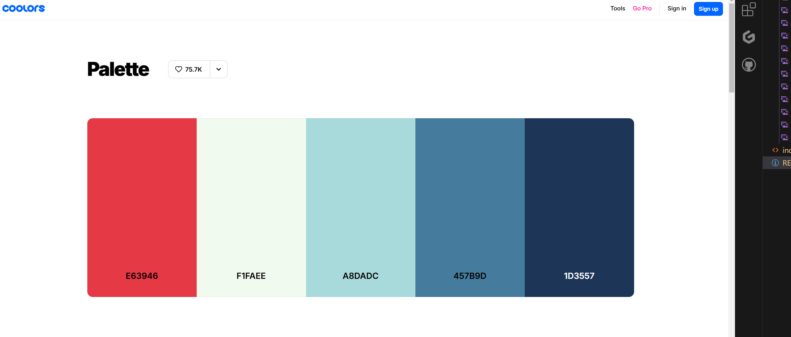

# Safety-Plus
Individual Formative Assignment: HTML, CSS, Bootstrap

# Introduction
Safety Plus! is a my first assessed project for the AI Assisted Full Stack Web Developer Bootcamp.
This project will be utilising HTML, CSS, Bootstrap & Microsoft Copilot assisted code to fulfill the brief for this project.
Safety Plus! is a handy cybersecurity guide for adults to safely navigate the tricky worldwide web.

Python bash - python3 -m http.server

## overview

## User Stories 
* As a user, I want to understand better how to avoid security risks
* As a user I want to be able to find resources to help me understand what cybersecurity is 
* As a user I want to be able to navigate the website easily via a menu
* As a user I want to be able to view this website on a phone, tablet and computer screen
* As a user I want social media pages to follow for more help
* As a user I want to be able to sign up to a newsletter to keep up to date with information about the topic
* As a user I want easy to udnerstand tips and guidelines

##### User stories generated by Microsoft Copilot, edited by myself to fit criteria

# Initial Design with Wireframes

Wireframes have been created using Balsamiq. The goal was to create an easy to navigate and understand page, as this project is aimed at those who may struggle with tech literacy.

#### Wireframe 1 - PC

#### Wireframe 1 - Mobile

### Favicon passes WCAG guidelines

### Background and font pass WCAG guidelines

### Cards pass WCAG Guidelines

### Color Palette used credit coolors

## Lighthouse Score, poor due to youtube embed

## Credits
Cybersecurity info from https://www.executech.com/insights/top-15-types-of-cybersecurity-attacks-how-to-prevent-them/#:~:text=5%20%E2%80%93%20DDoS.%20Distributed%20Denial%20of%20Service,shuts%20down%20or%20slows%20to%20unusable%20performance.

https://www.ncsc.gov.uk/ 

stock images from https://www.pexels.com/

color pallette from coolers https://coolors.co/palette/e63946-f1faee-a8dadc-457b9d-1d3557

